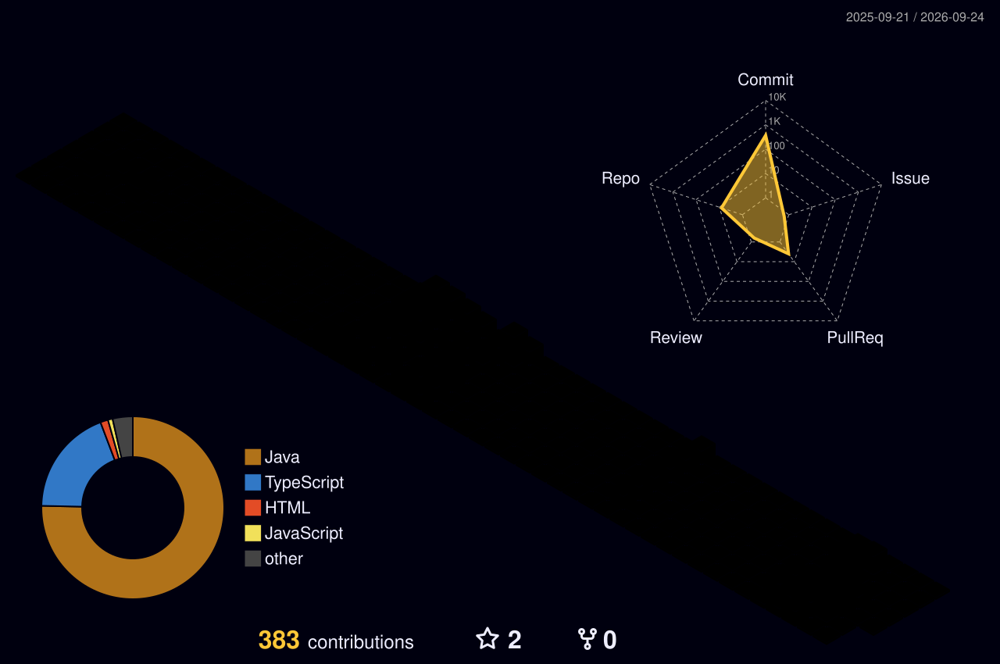

<div align="center">

<h1 align="center">
  
  
</h1>

### `Computer Science Undergraduate` · `Full-Stack Developer` · `AI Explorer`

<p>
  <a href="https://ujjwal-portfolio-dev.vercel.app/">
    
  </a>
  <a href="https://www.linkedin.com/in/ujjwal-singh-07baa5354">
    
  </a>
  <a href="mailto:ujjwalbhumi0@gmail.com">
    
  </a>
</p>


<br/>


</div>

---

## 🧑‍💻 About Me

```text
🎓 Computer Science Undergraduate
💻 Full-Stack Developer & Systems Thinker
🤖 Exploring AI Agents, LLMs & Intelligent Automation
🎨 Passionate about high-polish UI/UX and data-driven design
🌱 Building resilient tech around sustainability & real-world challenges
🚀 Fast-paced hackathon builder & open-source enthusiast
```

I build applications that blend **fluid user interfaces, scalable backend systems, and intelligent automation**.

Rather than just making features function, I engineer **the entire lifecycle** — from intuitive UX design and robust APIs to distributed caching, vector/graph stores, AI reasoning models, and seamless cloud deployments.

---

## 🚀 What I'm Building

<table>
<tr>
<td width="50%" valign="top">


<br/>

<div align="right">
  
</div>

### 💳 RecoverIQ
**Autonomous AI Revenue Recovery Engine**

An intelligent payment recovery and smart-dunning platform designed to recover failed subscriptions and transactions without blindly retrying cards.

<br/>

**Built With:**
<p>
  
  
  
  
  
</p>


</td>
<td width="50%" valign="top">


<br/>

<div align="right">
  
</div>

### 🕵️ EchoSnare
**AI Threat Intelligence & Disinformation Platform**

A high-powered investigation engine focused on detecting disinformation, verifying synthetic media/deepfakes, and revealing coordinated cyber threat networks.

<br/>

**Built With:**
<p>
  
  
  
  
</p>


</td>
</tr>
<tr>
<td width="50%" valign="top">


<br/>

<div align="right">
  
</div>

### 🎤 LeveLift
**AI Mock Interview Simulation Platform**

An interactive, real-time interview simulator that conducts adaptive voice-guided technical interviews with deep multi-metric performance feedback.

<br/>

**Built With:**
<p>
  
  
  
  
  
</p>


</td>
<td width="50%" valign="top">


<br/>

<div align="right">
  
</div>

### 🌱 Carbonly
**Sustainability & Carbon Footprint Intelligence**

A sustainability insights platform computing real-time carbon offsets, visualizing emissions habits, and empowering eco-conscious living through smart analytics.

<br/>

**Built With:**
<p>
  
  
  
  
</p>


</td>
</tr>
</table>

---

## ⚡ Tech Stack

<div align="center">

#### 💻 Programming Languages
<p>
  
  
  
  
  
  
</p>

#### 🌐 Frontend Engineering
<p>
  
  
  
  
  
  
</p>

#### ⚙️ Backend, Systems & Databases
<p>
  
  
  
  
  
  
  
  
</p>

#### 🤖 AI, Machine Learning & Intelligent Automation
<p>
  
  
  
  
  
</p>

#### 🛠️ DevOps, Tools & Design
<p>
  
  
  
  
  
  
</p>

</div>

---

## 📊 GitHub Analytics

<div align="center">


<br/><br/>


</div>

---

## 🧊 Contribution Graph — 3D View

<div align="center">



<sub>Generated automatically every day via GitHub Actions.</sub>

</div>

---

## 📈 My Developer Journey

<div align="center">

<table>
  <tr>
    <td align="center" width="20%">
      <br/><br/>
      🎨<br/>
      <b>UI / UX Design</b><br/>
      <sub>User Experience · Figma<br/>Wireframes · Interaction</sub>
    </td>
    <td align="center" width="20%">
      <br/><br/>
      💻<br/>
      <b>Frontend Dev</b><br/>
      <sub>React · Next.js · TypeScript<br/>Modern Web Architecture</sub>
    </td>
    <td align="center" width="20%">
      <br/><br/>
      ⚙️<br/>
      <b>Full-Stack Systems</b><br/>
      <sub>Node.js · Redis · PostgreSQL<br/>Queues & Async APIs</sub>
    </td>
    <td align="center" width="20%">
      <br/><br/>
      ☁️<br/>
      <b>Cloud & DevOps</b><br/>
      <sub>Docker · Microservices<br/>Resilient Deployments</sub>
    </td>
    <td align="center" width="20%">
      <br/><br/>
      🤖<br/>
      <b>AI Products</b><br/>
      <sub>Autonomous AI Agents · LLMs<br/>Intelligent Decision Engines 🚀</sub>
    </td>
  </tr>
</table>

</div>

---

## 🎯 2026 Goals & Objectives

<div align="center">

<table>
  <thead>
    <tr>
      <th width="72%">Mission & Vision</th>
      <th width="28%" align="center">Focus Status</th>
    </tr>
  </thead>
  <tbody>
    <tr>
      <td>🚀 <b>Production-Ready AI Applications</b><br/><sub>Architecting scalable, fault-tolerant autonomous platforms with reliable agent reasoning</sub></td>
      <td align="center"></td>
    </tr>
    <tr>
      <td>🤖 <b>Autonomous Agents & Graph Memory</b><br/><sub>Mastering tool-use, multi-agent coordination, and graph databases (Neo4j) for threat intelligence</sub></td>
      <td align="center"></td>
    </tr>
    <tr>
      <td>☁️ <b>Distributed Systems & High-Throughput Backends</b><br/><sub>Engineering event-driven pipelines, Redis/BullMQ task queues, and low-latency APIs</sub></td>
      <td align="center"></td>
    </tr>
    <tr>
      <td>🧠 <b>Algorithmic Mastery & Problem Solving</b><br/><sub>Continuous DSA practice, data structure optimization, and clean system design</sub></td>
      <td align="center"></td>
    </tr>
    <tr>
      <td>🏆 <b>Hackathons & Fast-Paced Innovation</b><br/><sub>Building impactful, real-world solutions under high pressure and rapid iteration</sub></td>
      <td align="center"></td>
    </tr>
    <tr>
      <td>🌱 <b>Sustainable & Climate Technology</b><br/><sub>Creating data-backed tools that empower users to track, reduce, and offset carbon emissions</sub></td>
      <td align="center"></td>
    </tr>
  </tbody>
</table>

</div>

---

## 🏆 Hackathons & High-Impact Building

<div align="center">


<br/>

### ⚡ *"Under 48 hours of pressure, engineering turns into pure momentum."*

<br/>

<table>
  <tr>
    <td width="33%" align="center" valign="top">
      <br/><br/>
      🚀<br/>
      <b>Rapid Prototyping</b><br/>
      <sub>Transforming high-level concepts into fully functional production deployments in weekend sprints.</sub>
    </td>
    <td width="33%" align="center" valign="top">
      <br/><br/>
      🤖<br/>
      <b>AI-Native Systems</b><br/>
      <sub>Orchestrating autonomous agents, voice AI (Vapi), LLM tool-calling, and graph neural data (Neo4j).</sub>
    </td>
    <td width="33%" align="center" valign="top">
      <br/><br/>
      🛡️<br/>
      <b>High-Stakes Systems</b><br/>
      <sub>Fault-tolerant payment retries, deepfake detection, and data-driven sustainability metrics.</sub>
    </td>
  </tr>
</table>

<br/>

#### 🎯 Active Hackathon Arenas & Domains
<p>
  
  
  
  
  
</p>


</div>

---

## 💬 Let's Connect

<div align="center">

I'm always open to **collaborations, ambitious hackathons, innovative ideas, and building impactful engineering products.**

<p>
  <a href="https://ujjwal-portfolio-dev.vercel.app/">
    
  </a>
  <a href="mailto:ujjwalbhumi0@gmail.com">
    
  </a>
  <a href="https://www.linkedin.com/in/ujjwal-singh-07baa5354">
    
  </a>
</p>

<br/>

### ✨ *"I believe good design is invisible until it's missing."*

</div>

---

<div align="center">

### ⭐ If you find something interesting here, consider starring the repository!


</div>
